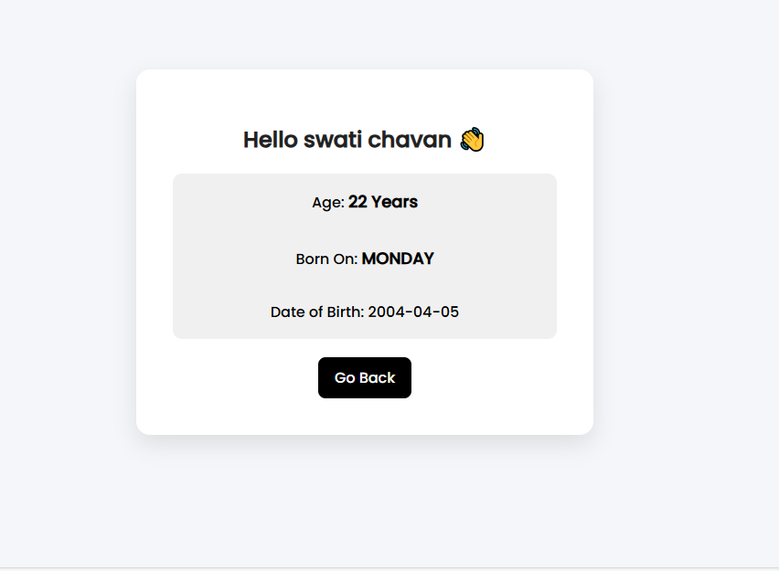

# 2BL23CS169---Age-Calculator
JSP Age Calculator Web Application
# Age Calculator Web Application

##  Project Description

This is a web-based **Age Calculator** developed using **JSP, HTML, and CSS**.
The application allows users to enter their name and date of birth, and it calculates the current age along with the day of the week they were born.

---

## Technologies Used

* HTML
* CSS
* JSP (Java Server Pages)
* Java (`java.time` package)
* Apache Tomcat Server

---

## Input

The user provides:

* Name
* Birth Year
* Birth Month (1–12)
* Birth Day (1–31)

---

##  Output

The application displays:

* User's Name
* Age (in years)
* Day of Birth (e.g., Monday)
* Date of Birth

---

## ✨ Features

* Clean and professional UI
* Input validation
* Responsive design
* UTF-8 encoding support (emoji compatible 👋)
* Back navigation option

---

## How to Run

1. Install Apache Tomcat Server
2. Place the project folder inside `webapps`
3. Start the server
4. Open browser and run:

http://localhost:8080/2BL23CS169-AgeCalculator/

---

##  Screenshots

### 🔹 Input Page

### 🔹 Output Page

---

##Author

* USN: 2BL23CS169

---

## Repository Link

https://github.com/swatischavan05-crypto/2BL23CS169-AgeCalculator
